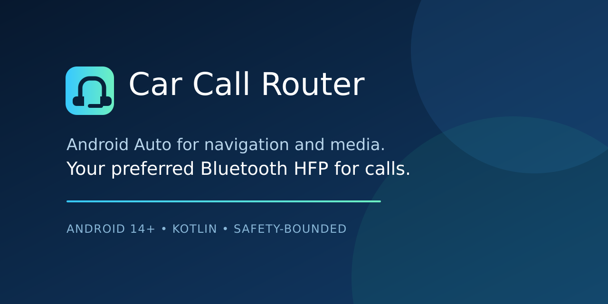

# Car Call Router for Android Auto and Bluetooth HFP

[](https://github.com/itaymatza/car-call-router/actions/workflows/build.yml)
[](https://github.com/itaymatza/car-call-router/actions/workflows/codeql.yml)
[](https://github.com/itaymatza/car-call-router/releases)
[](https://github.com/itaymatza/car-call-router/releases)
[](LICENSE)

[**Download latest APK release**](https://github.com/itaymatza/car-call-router/releases) · [All versions and release notes](https://github.com/itaymatza/car-call-router/releases)



**Keep Android Auto for navigation and media while routing calls through the Bluetooth hands-free device you trust.**

The installed app and this repository are both named **Car Call Router**, so people searching for
an Android Auto call-audio or Bluetooth microphone routing fix can find and recognize it easily.

## The problem

Some phones connected to both Android Auto and a vehicle's native Bluetooth system send calls to
the Android Auto head unit. On aftermarket units, that can mean a poor microphone even when the
vehicle's native hands-free system works well.

Car Call Router automates the same choice a user can make from the active-call audio selector:
when an eligible cellular call becomes active, it asks Android Telecom to use a **current,
user-chosen Bluetooth call endpoint**. Android Auto remains connected for navigation and media.
The app does not become the default dialer or manipulate general media routing through
`AudioManager`.

### Common symptoms this project targets

- Android Auto uses the wrong or poor-quality microphone for phone calls.
- Calls go through an aftermarket Android Auto head unit instead of the car's native Bluetooth.
- You want Android Auto to stay connected for maps and music while another Bluetooth HFP device
  handles call speaker and microphone audio.
- Manually selecting the preferred car Bluetooth device during every call works, but you want that
  call-audio selection automated.

If those phrases describe your problem, start with [Is this for me?](#is-this-for-me) and the
[compatibility guide](docs/DEVICE-COMPATIBILITY.md).

## Is this for me?

It may fit when all of these are true:

- the phone runs Android 14 or newer;
- Android Auto and the preferred Bluetooth hands-free device are connected at the same time;
- manually choosing that Bluetooth device during a call already fixes both speaker and microphone;
- a one-time ADB authorization is acceptable.

It is not a fix for pairing failures, broken Bluetooth hardware, media-routing problems, emergency
calls, or systems where the preferred device is absent from Android's in-call audio selector. See
the [compatibility guide](docs/DEVICE-COMPATIBILITY.md) and [FAQ](docs/FAQ.md) before installing.


> This repository contains source code, deterministic tests, and a build workflow. The tracked source tree does **not** include device configurations, Bluetooth addresses, signing materials, APKs, or exported logs. Successful GitHub Actions runs publish a generated debug APK as a downloadable build artifact.

## Project status

The routing proof of concept has been confirmed by the project owner on the intended Samsung + Android Auto + native BMW Bluetooth setup: an active cellular call moved to the selected native hands-free endpoint, including its microphone, while Android Auto remained active. That confirms the core approach, not production reliability. Version `0.3.0-beta.12` replaces callback fighting with a one-shot BMW request verified by actual HFP/SCO ownership, restores Samsung's manual selector only for the exact captured split state, and records complete redacted evidence for the next parked test; see the [production-readiness gates](docs/PRODUCTION-READINESS.md).


## Public-repository posture


The tracked tree contains no real target-device settings. Device names and Bluetooth addresses are selected at runtime and stored only in the application’s private local preferences. Generated APKs, IDE configuration, local SDK configuration, test logs, captures, and conventional key/certificate files are excluded by `.gitignore`. GitHub Actions compiles, unit-tests, lints, and verifies the source. Normal builds upload an expiring debug artifact; every successful main-branch push also publishes a commit-specific debug pre-release signed with a protected, persistent key with an APK, digest, and verification report. No APK is committed to the repository.


A public repository still exposes its files, commit history, issue/discussion content, and workflow logs. Do not commit exported logs, screenshots, pairing records, keystores, certificates, API keys, or private test notes. If the repository should not be forked, copied, or associated with its GitHub owner, use a private repository and consider a separately planned history rewrite.


## Configuration


### Build-time identity


The source namespace is the generic value `org.carcallrouter.companion`. Override the installed application ID and version metadata through Gradle properties without changing source:


```sh
bash gradlew \
  -PAPP_APPLICATION_ID=example.callroute \
  -PAPP_VERSION_CODE=14 \
  -PAPP_VERSION_NAME=0.3.0-beta.12 \
  :app:assembleDebug
```


`APP_APPLICATION_ID` defaults to `org.carcallrouter.companion`; `APP_VERSION_CODE` defaults to `14`; and `APP_VERSION_NAME` defaults to `0.3.0-beta.12`. Choose an application ID that you control before distributing a build. The source namespace remains generic and fixed so Kotlin and manifest class references stay consistent.


### Runtime configuration


The app is configuration-driven at runtime. Grant the requested runtime permissions, select the exact paired call device, complete the one-time ADB authorization, and verify the result in the app. If the Android Auto head unit is a separate Bluetooth call device, optionally select that exact competing device. This permits one bounded manual-selector recovery when it is confirmed to own HFP audio after a failed target request; it does not enable another target request. The UI contains no built-in device name, address, car brand, phone brand, or dialer requirement.

## Why ADB is required

`MANAGE_ONGOING_CALLS` is a `signature|appop` permission. Android documents the companion path specifically for a physical **wearable**; associating a car is not a supported general grant mechanism. A normal utility APK also cannot request this permission through a runtime dialog. The other supported route is becoming the default dialer, which requires a complete dial pad plus incoming and ongoing call UI and would replace the user's existing Phone experience. This project deliberately does not impersonate an incomplete dialer.

The selected architecture is therefore a non-UI `InCallService` with a one-time ADB AppOps grant. The app checks `TelecomManager.hasManageOngoingCallsPermission()` and never treats a command, button tap, or service declaration as proof of authorization.


See the exact [authorization and troubleshooting guide](docs/AUTHORIZATION.md), [configuration guidance](docs/CONFIGURATION.md), [safety and privacy boundaries](docs/SAFETY.md), and [testing guidance](docs/TESTING.md).


## Releases and downloads

[GitHub Releases](https://github.com/itaymatza/car-call-router/releases) is the canonical version
history. Each published version has release notes and durable downloadable files, so a GitHub
account is not required just to download the APK.

| Version | Channel | Downloads |
| --- | --- | --- |
| `0.3.0-beta.12` | Android 14+ debug beta | [Latest commit-specific APK, SHA-256, and verification report](https://github.com/itaymatza/car-call-router/releases) |
| `0.3.0-beta.10` | Previous Android 14+ debug beta | [Release](https://github.com/itaymatza/car-call-router/releases/tag/v0.3.0-beta.10-debug) |
| `0.3.0-beta.9` | Previous Android 14+ debug beta | [Release](https://github.com/itaymatza/car-call-router/releases/tag/v0.3.0-beta.9-debug) |
| `0.3.0-beta.7` | Previous Android 14+ debug beta | [Release](https://github.com/itaymatza/car-call-router/releases/tag/v0.3.0-beta.7-debug) |
| `0.3.0-beta.6` | Previous Android 14+ debug beta | [Release](https://github.com/itaymatza/car-call-router/releases/tag/v0.3.0-beta.6-debug) |
| `0.3.0-beta.5` | Previous Android 14+ debug beta | [Release](https://github.com/itaymatza/car-call-router/releases/tag/v0.3.0-beta.5-debug) |

A new debug APK is published for each successful push to `main` on the [Releases page](https://github.com/itaymatza/car-call-router/releases). Each file and version includes the source commit ID. Protected debug signing must be configured before publication; the pinned certificate blocks unexpected keys. The first protected-key APK requires a one-time reinstall for users of beta.11 or the initial beta.12 build. Later protected-key builds can update each other in place.

## Download and install the APK

The easiest path is the durable direct download:

1. Open [GitHub Releases](https://github.com/itaymatza/car-call-router/releases) and download the `.apk` from the newest `0.3.0-beta.12` debug pre-release.
2. Open the downloaded APK on the Android device.
3. If Android prompts you, temporarily allow **Install unknown apps** for the browser or file
   manager, install the APK, and then disable that permission again.

If Android reports that the package cannot be updated or is incompatible with the installed version, uninstall the existing build first and retry. Uninstalling clears the app's local configuration.

> This is a durable debug/test pre-release for Android 14+, not a production-ready signed release.
> Installation alone does not grant protected Telecom access. Open the app and complete the
> one-time authorization flow below. See the [release notes](docs/DEBUG-PRERELEASE-NOTES.md) and
> [production-readiness gates](docs/PRODUCTION-READINESS.md).

The [Actions build artifact](https://github.com/itaymatza/car-call-router/actions/workflows/build.yml)
remains available as a fallback for testing the newest `main` commit, but it requires a GitHub
sign-in, downloads as a ZIP, and expires.

### Authorize call routing in the app

1. Pair the intended car or headset in Android's Bluetooth settings and keep it nearby and powered on.
2. Open Car Call Router and select **Allow permissions**.
3. Select **Choose Bluetooth device**, then choose the intended call device.
4. Select **Set up one-time ADB authorization** and follow the displayed steps.
5. Return to the app and tap **Verify**. Continue only after the status says authorization is detected.

See the exact [authorization and troubleshooting guide](docs/AUTHORIZATION.md), [configuration guidance](docs/CONFIGURATION.md), [research decision](docs/PLATFORM-RESEARCH.md), and [parked-car test procedure](docs/TESTING.md).

For repeatable in-place beta upgrades, configure the protected signed build described in
[stable beta signing](docs/SIGNING.md). Ordinary GitHub debug artifacts do not have a stable
certificate across hosted runners; the signed workflow also pins the expected certificate digest.

## Project documentation


Start with the [FAQ](docs/FAQ.md) and [compatibility guide](docs/DEVICE-COMPATIBILITY.md). Read the
[architecture reference](docs/ARCHITECTURE.md) for the component boundaries and routing state
machine. The [public-release guide](docs/PUBLIC_RELEASE.md) explains what remains visible in a
public repository and how to review a change before pushing it. The
[app metadata guide](docs/APP-METADATA.md) keeps the installed identity, release hub, and reusable
store listing aligned. Contributors should follow
[CONTRIBUTING.md](CONTRIBUTING.md); suspected security, privacy, or safety vulnerabilities belong
in the private reporting path described by [SECURITY.md](SECURITY.md), not a public issue.


## Safety model and limitations


The policy fails closed. It requires Telecom authorization, runtime permissions, a verifiably SIM-backed non-emergency call, a single active call, a configured target present in both Telecom and HFP state, and—when using automatic mode—a verified projection-host state. Evidence may arrive for up to ten seconds. Call-start routing settles for at least 300 ms, with recent activity extending the wait up to 900 ms. The app makes at most one target request and allows four seconds for exact target HFP/SCO confirmation; it never retries or reasserts the target. If that window ends in the exact observed split state—Telecom displays the target while the explicitly configured competing endpoint still owns SCO—the app may make one additional, bounded request to display that already-active competing endpoint so the target becomes manually selectable again. Without that configured device, recovery is unavailable because the app cannot safely guess which of several HFP devices owns Android Auto audio. A protected speaker, handset, wired, or other-Bluetooth route stops further policy action. An already-submitted platform request cannot be recalled. The explicit manual one-shot bypasses only the automatic toggle and projection gate; it does not bypass authorization, identity, device-presence, or emergency safeguards.


Routing uses API 34+ `requestCallEndpointChange()` with an endpoint object from the latest `onAvailableCallEndpointsChanged()` callback. The deprecated `requestBluetoothAudio(BluetoothDevice)` path has been removed. Because the public endpoint API exposes a name and UUID but no Bluetooth address, the app resolves identity only when the saved device name is unique among live Bluetooth endpoints, or when exactly one HFP device and one Bluetooth endpoint exist. Ambiguity fails closed. Endpoint UUIDs are not persisted.

Diagnostics deliberately distinguish `TELECOM_ENDPOINT_CONFIRMED` from
`TARGET_HFP_AUDIO_CONFIRMED`. The former means Telecom selected the intended endpoint object; the
latter also corroborates that the exact locally configured Bluetooth address owns HFP audio/SCO.
Neither replaces a parked physical microphone and speaker test.


> Configure and test only while parked. Do not rely on this project for emergency, safety-critical, or hands-free compliance use cases.


## Verification

Run `bash tools/test-all.sh` for the pure-JVM core, deterministic property, exhaustive eligibility, JSONL replay, and service-callback suites. CI enforces at least 95% line / 90% branch coverage for `:core` and 90% line / 75% branch coverage for the production Telecom-service boundary, excluding framework stubs and test drivers. Host contracts also run on JDK 17 and 21. The pull-request workflow uploads HTML/XML coverage and JUnit reports, assembles the APK, runs Android lint, verifies APK signature and manifest identity, and reruns when a PR is retargeted to `main`. Passing those checks does not establish stable Samsung, Android Auto, Bluetooth, microphone, or speaker behavior; use the parked-car procedure and stability matrix in [testing guidance](docs/TESTING.md).

For repeatable real-device evidence, run
`bash tools/capture_device_run.sh --serial PHONE_SERIAL --scenario outgoing` while parked. The
harness stores only new structured app traces plus explicit physical observations in a local,
Git-ignored run directory and emits `PASS` only when exact HFP audio and all required observations
agree. Each session includes a privacy-safe device/app environment record and deduplicated evidence
snapshots showing Telecom's route beside the actual HFP/SCO owner. Controlled tags classify each
matrix cell, and

```sh
python3 tools/summarize_qualification.py verification/device-runs --require-ready
```

verifies that the batch used one APK/phone build and reached every required passing count.
